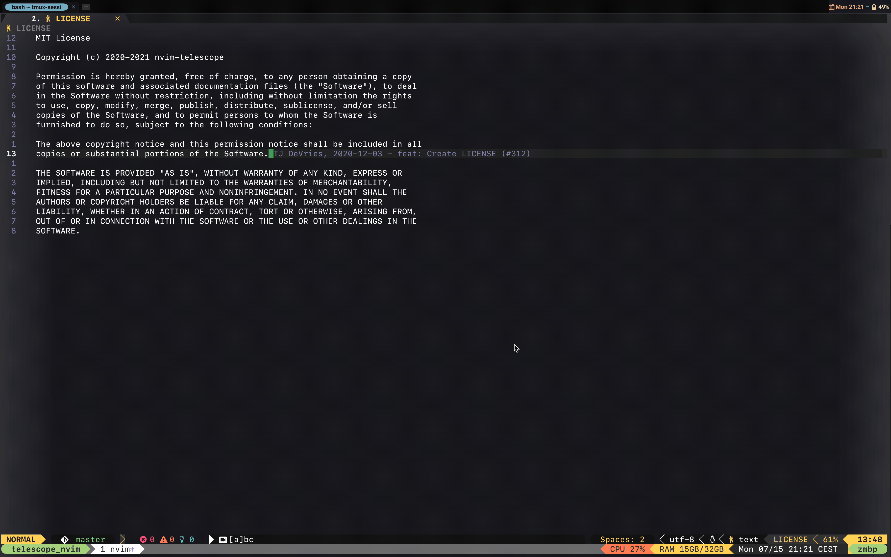
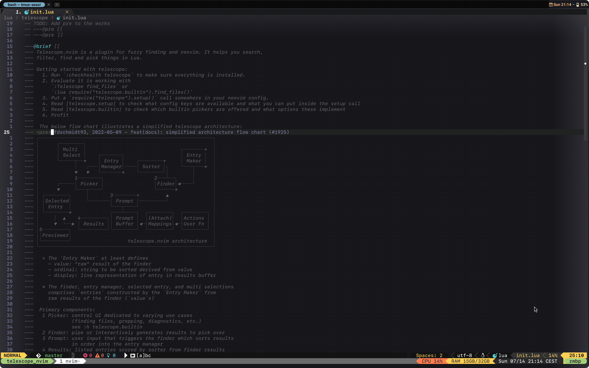
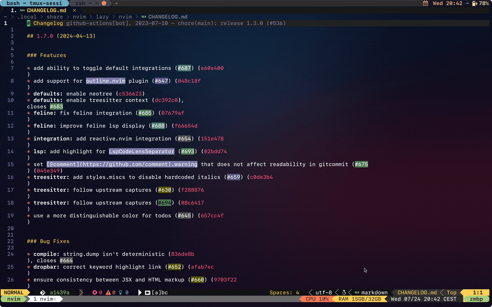

# Telescope Tmuxing

## ? What is Telescope-Tmuxing ?
This is a Telescope plugin for easily handling and navigating Tmux sessions and windows inside Neovim. It was inspired by [telescope-tmux.nvim](https://github.com/camgraff/telescope-tmux.nvim) and started as a set of additional feature changes. However, it grew too large to be a simple enhancement, so it became a separate project.

The plugin provides a list of sub-directories found in the paths defined in the scan_paths configuration part of create_session. The scan_paths list (the root of the results) is also included in the result set.

## 📁 Table of Contents
- [Dependencies](#dependencies)
- [Installation](#installation)
- [Setup](#setup)
- [Features](#features)
    - [Sessions](#sessions)
        - [Create new session](#create-new-session)
        - [List other sessions](#list-other-sessions)
        - [List other sessions with windows](#list-other-sessions-with-windows)
        - [Kill session(s)](#kill_sessions)
            - [Kill in list view](#kill-in-list-view)
            - [Kill current session](#kill-current-session)
        - [Rename session](#rename-session)
            - [Rename session in list view](#rename-session-in-list-view)
            - [Rename current session](#rename-current-session)
        - [Jump to previous session](#jump-to-previous-session)
    - [Windows](#windows)
        - [Create new window](#create-new-window)
        - [List windows of current session](#list-windows-of-current-session)
        - [Kill window(s)](#kill_windows)
            - [Kill in list view](#kill-in-list-view)
            - [Kill current window](#kill-current-window)
        - [Rename window](#rename-window)
            - [Rename window in list view](#rename-window-in-list-view)
            - [Rename current wincow](#rename-current-window)
        - [Jump to previous window](#jump-to-previous-window)
- [Planned improvements/additional features](#future-improvements)

## <a name="dependencies"></a>⚡ Dependencies
- Required
    - [Tmux](https://github.com/tmux/tmux)
    - [Neovim](https://github.com/neovim/neovim) (the stable release should be enough)
    - [Telescope](https://github.com/nvim-telescope/telescope.nvim)
    - [Plenary](https://github.com/nvim-lua/plenary.nvim) is required for path-based session creation
- Optional
    - [Nvim Notify](https://github.com/rcarriga/nvim-notify) for better notifications. If installed, `telescope-tmux` will use this for notifications by default.
    - [Dressing](https://github.com/stevearc/dressing.nvim) improves the appearance and usability of input and selector windows, enhancing the user experience.

## <a name="installation"></a>📦 Installation
<details>
  <summary>Lazy</summary>

```lua
{
  'pre-z/telescope-tmuxing.nvim',
  opts = {},
}
```
</details>

<details>
  <summary>Packer</summary>

```lua
require('packer').startup(function()
    use {'pre-z/telescope-tmuxing.nvim'}
end)
```
</details>

<details>
  <summary>Paq</summary>

```lua
require "paq" {
    {'pre-z/telescope-tmuxing.nvim'};
}
```
</details>

<details>
  <summary>vim-plug</summary>

```vim
Plug 'pre-z/telescope-tmuxing.nvim'
```
</details>

## ⌨️<a name="setup"></a> Setup
To customize the session creation based on a path list, you need to define at least this config property, otherwise, the plugin will use your current directory only (by default the scan path list only contains the current directory; if you specify your own, that will overwrite this default list). To setup the scan path do the following:

```lua
opts = {
extensions = {
  tmux = {
    use_nvim_notify = true,
    create_session = {
      scan_paths = { }, -- add your path list here as a string array
    },
  },
},
},
```
To have it applied, call telescope setup method with the above option (see a complete Lazy based config for details below):
```lua
require("telescope").setup(opts) -- opts is the one defined above
```
<details>
  <summary>Default options</summary>

```lua
---@type TmuxConfig
local __TmuxDefaultConfig = {
  cache_folder = vim.api.nvim_call_function("stdpath", { "state" }) .. "/telescope-tmuxing",
  sort_sessions = "last_used", -- possible options: "last_used", "session_name"
  list_sessions = "simple", -- options: "full", "simple"
  sort_windows = "last_used", -- possible options: "last_used", "session_name"
  keep_telescope_open = true, -- after quick actions (e.g. deleting/renaming session) keep telescope window open
  cross_session_window_switch = false, -- if true switch to previous session will consider all windows across all active sessions
  create_session = { -- this section configures Plenary directory scanner
    scan_paths = { "." }, -- string list of path, you can use ~/ for home directory
    scan_pattern = nil, -- regex to filter out scan results
    scan_depth = 1,
    respect_gitignore = true,
    include_hidden_dirs = false,
    only_dirs = true, -- not recommended to change to false, but if you have symlinks of directories it may be useful, but make sure you select only directories or their symlinks
    previewer_command = { "ls", "-la" },
  },
  create_window = { -- plenary configuration options
    scan_paths = {}, -- this can be empty if include_cwd is turned on
    include_cwd = true, -- will run vim.fn.getcwd() and will include it in scan_paths, this gives a good compatibility with neo-tree if you change the root path during your session
    scan_pattern = nil,
    scan_depth = nil,
    respect_gitignore = true,
    include_hidden_dirs = false,
    only_dirs = true,
    previewer_command = { "ls", "-la" },
  },
  nvim_notify = { -- configuration options for nvim_notify
    icon = "﬿",
    title = "Telescope Tmux",
    timeout = 3000,
  },
  layout_strategy = "horizontal",
  layout_config = { preview_width = 0.78 },
}
```
</details>

<details open>
    <summary><a name="LazyConfig"></a>Full Lazy Configuration Example</summary>

```lua
{
  "pre-z/telescope-tmuxing.nvim",
  dependencies = {
    "nvim-telescope/telescope.nvim",
    "nvim-lua/plenary.nvim",
    -- optionals
    "rcarriga/nvim-notify",
    "stevearc/dressing.nvim", -- for better input windows
  },
  opts = {
    extensions = {
      tmux = {
        use_nvim_notify = true, -- not necessary to specify the true value, if nvim_notify available it will be used, unless this is explicitly false
        create_session = { -- plenary configuration options
          scan_paths = {
            "~/", -- home directory
            ".", -- current directory
          },
          scan_pattern = nil,
          scan_depth = 1,
          respect_gitignore = true,
          include_hidden_dirs = false,
          only_dirs = true,
          previewer_command = { "ls", "-la" },
        },
      },
    },
  },
  keys = { -- keymapping
    {
      "<leader>ts",
      "<cmd>lua require('telescope').extensions.tmux.switch_session({ list_sessions = 'simple'})<cr>",
      desc = "Swtich Tmux session",
    },
    {
      "<leader>tS",
      "<cmd>lua require('telescope').extensions.tmux.switch_window()<cr>",
      desc = "Switch Tmux window of current session",
    },
    {
      "<leader>ta",
      "<cmd>lua require('telescope').extensions.tmux.switch_session({ list_sessions = 'full'})<cr>",
      desc = "All other Tmux sessions and windows list",
    },
    {
      "<leader>tc",
      "<cmd>lua require('telescope').extensions.tmux.create_session()<cr>",
      desc = "Tmux create new sessions",
    },
    {
      "<leader>tC",
      "<cmd>lua require('telescope').extensions.tmux.create_window()<cr>",
      desc = "Tmux create new window",
    },

    {
      "<leader>=",
      "<cmd>lua require('telescope').extensions.tmux.switch_prev_session()<cr>",
      desc = "Tmux switch to previous session",
    },
    {
      "<leader>-",
      "<cmd>lua require('telescope').extensions.tmux.switch_prev_window()<cr>",
      desc = "Tmux switch to previous window",
    },

    {
      "<leader>tr",
      "<cmd>lua require('telescope').extensions.tmux.rename_current_session()<cr>",
      desc = "Rename current Tmux session",
    },
    {
      "<leader>tR",
      "<cmd>lua require('telescope').extensions.tmux.rename_current_window()<cr>",
      desc = "Rename current Tmux window",
    },
    {
      "<leader>tk",
      "<cmd>lua require('telescope').extensions.tmux.kill_current_session()<cr>",
      desc = "Kill current Tmux session",
    },
    {
      "<leader>tK",
      "<cmd>lua require('telescope').extensions.tmux.kill_current_window()<cr>",
      desc = "Kill current Tmux window",
    },
  },
  config = function(_, opts)
    require("telescope").setup(opts) -- configure telescope with telescope-tmuxing plugin options
    require("telescope").load_extension("tmux") -- load tmux plugin
  end,
}
```
</details>

## <a name="features"></a>💡 Features

### <a name="sessions"></a>💻 Sessions

#### Create new session

Gives a list of sub-directories found on the paths defined in the `scan_paths` configuration part of create_session. The `scan_paths` list (the root of the results) is also included in the result set.

##### Handled scenarios:
<details>
    <summary>Create a new session on selected path (if no session exists with the parsed name)</summary>


</details>

<details>
    <summary>Create new session on the selected path, but with different name if session already exists with the parsed name</summary>


</details>

<details>
    <summary>Create new session on the selected path, but switch to the session if it exists with the same name</summary>


</details>

#### List other sessions

Lists other active sessions.

##### Available keyboard actions:

|Mapping|Description|Modes|
|---|---|---|
|`<c-k>`|Kill the selected session(s)|n,i|
|`<c-e>`|Rename the selected session (only one at a time)|n,i|
|`<cr>`|Switch to the selected session|n,i|

##### Handled scenarios
<details>
    <summary>List other active sessions</summary>


</details>

<details>
    <summary>Kill a selected session</summary>


</details>

<details>
    <summary>Kill multiple sessions</summary>


</details>

#### List other sessions with windows

<details>
    <summary>Lists the other active Tmux sessions and their windows. All of the functionalities described for the simple session listing are also available here namely session switch, session rename and session kill. In addition to this, it can differentiate if you would like to delete a window inside a session or a session itself.</summary>


</details>


To get this kind of session listing, call `switch_session` with `{ list_sessions = 'full'}` option. See the [example Lazy config](#LazyConfig) for details.
The same keyboard mapping is available here as for the simple session listing.

#### <a name="kill_sessions"></a>Kill session(s)

One or more sessions can be killed in both the simple and session-window listing view. For multiple selection, use the tab key as you would normally use for Telescope multi-select.

##### <a name="session_kill_in_list"></a>Kill in list view

One or more sessions can be killed in session list mode. See kill session(s) [here](#handled-scenarios) for details.

##### Kill current session

It is possible to kill the active session with a single command. If the active session is killed, Tmuxing will switch to the previously used session. If there is no previous session, then session kill won't take place. If a previous session exists (session kill is possible), then the current session can be killed in two ways:
- simply kill the session without saving any modified buffer (this is the default); this can be useful for ephemeral sessions
- save all changed buffers before killing the session

<details>
    <summary>Unfold for demo</summary>


</details>


#### Rename session

##### Rename session in list view

<details>
    <summary>In list view, only one session rename is allowed at a time.</summary>


</details>

> [!NOTE]
> Because Telescope seems to have a weird reservation for `<c-r>` keybinding, the rename keybinding is set to be `<c-e>`.

##### Rename current session

<details>
    <summary>It is also possible to rename the current session.</summary>


</details>


#### Jump to previous session

<details>
    <summary>For convenience and effective navigation, it is possible to jump back to the last used session.</summary>


</details>

### <a name="windows"></a>🪟 Windows

#### Create new window

The content to show for the path list where to create the new window can be set up by two configuration properties:
 - The first one is the `create_window.scan_paths` where you can define static path lists similarly to the one for session creation. This list can be even empty (this is the default).
 - The second one is the `create_window.include_cwd`, which is a boolean property. If it is true, Tmuxing will run `vim.fn.getcwd()` to get the actual project root. This can be useful if you use the `set_root` feature of Neo-tree, so you will see folders from the actual project root.

Window creation also handles the same [scenarios](#handled-scenarios) as session creation does.
<details>
    <summary>Unfold for demo</summary>


</details>

#### List windows of current session

Lists the other windows (except the active one) of the active session. Plain window listing only supports the current session's other (except the active one) windows list. If you need to see other session's window list, use the  [session listing with windows command](#list-other-sessions-with-windows).

##### Available keyboard actions:

|Mapping|Description|Modes|
|---|---|---|
|`<c-k>`|Kill the selected window(s)|n,i|
|`<c-e>`|Rename the selected window|n,i|
|`<cr>`|Switch to the selected window|n,i|

#### <a name="kill_windows"></a>Kill window(s)

##### Kill in list view

In window list view, one or more windows can be terminated the same way as [sessions in session list](#session_kill_in_list).

##### Kill current window

The current window can be killed in exactly the same way as the current session. For the handled scenarios, see the related session [description](#kill-current-session). For the configuration part see the example Lazy [configuration](#LazyConfig) for `Kill current Tmux window` setup.

#### Rename window

##### Rename window in list view

Window rename offers the same experience as described in [session rename in list view](#rename-session-in-list-view).

##### Rename current window

This works the same as [current session rename](#rename-current-session).

#### Jump to previous window

By default, jump to previous window works the same as the [jump-to-previous-session](#jump-to-previous-session) functionality and it works for the current session scope. 

There is a configuration property namely `cross_session_window_switch` (by default this is false) and if it is true, the previously used window will be considered across sessions. If you use windows heavily across sessions, this window switch can be used to resolve the last used window even if it is from another session (in this case, this works as a session switch) or from the same session.

### <a name="future-improvements"></a>🪴Planned improvements/additional features

- lualine support to show previous session and previous window name
- session/window creation based on a list of the history of previous sessions
- provide API interface to create session or window by other plugin calls, this could be used for integration on
    - [ThePrimeagen/git-worktree.nvim](https://github.com/ThePrimeagen/git-worktree.nvim) for example to switch to a worktree in a separate Tmux window
    - [moyiz/git-dev.nvim](https://github.com/moyiz/git-dev.nvim) for example to open downloaded repository in a separate Tmux session
